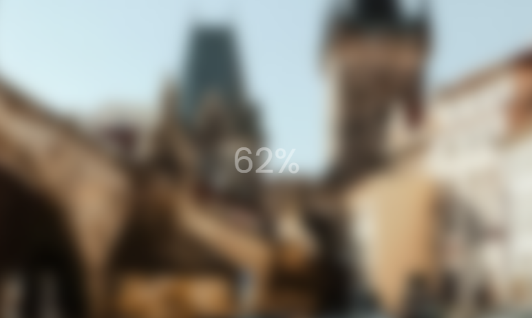

# Blurry Loading Clone Project

## 1. Project Description

Build a clone of a Blurry Loading using HTML, CSS and Javascript.
This is a small project about blurry loading.

## 2. Tech Stack
1. HTML
2. CSS
3. JavaScript

## 3. Installing
1. Clone the repo
```
https://github.com/VoDuyThienVinh/BurryLoading
```
2. Open Project Folder
3. Explore
4. Open index.html in Visual Studio Code, using Live Server
5. Enjoy :)

## 4. Screenshots


## 5. Link Github-Page
```
https://voduythienvinh.github.io/BurryLoading/
```

## Adapted From:
Udemy Course: 50 Project in 50 Days - HTML, CSS & Javascript
Project Name: Day 5 - Blurry Loading
Create by: Brad Traversy, Florin Pop
Last updated 12/2020
URL: https://www.udemy.com/course/50-projects-50-days/
